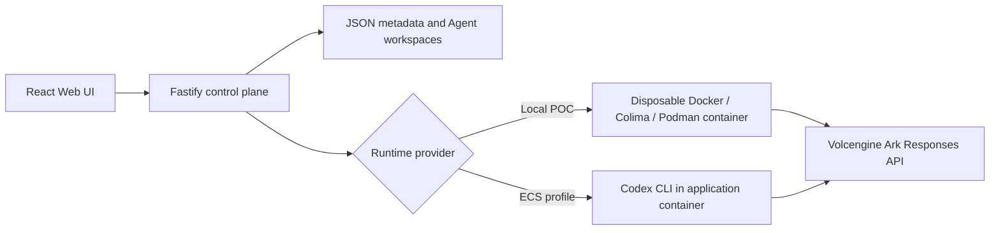

# Volc Agent Launchpad

A minimal Agent platform for three-day middleware hackathons. It provides Agent
CRUD, a browser Playground, persistent workspaces, and Codex CLI backed by the
Volcengine Ark Responses API.

Run it locally with Docker, Colima, or rootless Podman, or deploy it to
Volcengine ECS.

> [!NOTE]
> **TikTok TechJam 2026 — Track 1 submission. Selected direction: identity
> and authorization middleware.**
> The Starter Kit's single shared bearer token has been replaced with real
> human sessions, a distinct principal for every Agent, scoped and revocable
> delegation grants, short-lived per-Run action tokens, an enforcing resource
> server, a human approval gate, and an append-only authorization trail.
> Read [`docs/IDENTITY_MIDDLEWARE.md`](docs/IDENTITY_MIDDLEWARE.md) for the
> design, [`docs/architecture-identity.md`](docs/architecture-identity.md)
> for the one-page diagram, and [`DEMO.md`](DEMO.md) for the demo script.

## The middleware in one minute

An Agent is not a feature of a user account. It is a separate actor that runs
unattended, driven by a model that reads untrusted input and decides what to
do next. So it gets its own identity, and its authority is checked where the
work happens rather than where the work is requested.

```
alice  ──signs in──▶  control plane  ──token exchange──▶  action token
                                                          sub: alice
                                                          act: agent/3f2a1c4b
                                                          scope: [docs:read]
                                                          exp: +5 minutes
                                                          bound to: this Run
                                                                │
                                          Agent Runtime ────────┘
                                                │
                                                ▼
                                       resource server
                                       ├─ doc-a1 (alice) ──▶ 200
                                       └─ doc-b1 (bob)   ──▶ 404 cross_user_denied
```

- **Two principals.** A human signs in with a password. An Agent gets its own
  principal at creation, with its own generation and its own kill switch. Audit
  records name both: *Alice, through agent/3f2a1c4b, tried to read doc-b1.*
- **Delegation, not impersonation.** A grant is scoped, time-bound and
  revocable. It can only carry data-plane scopes, only scopes the delegator
  holds, and it reaches only the delegator's own resources.
- **Short-lived credentials.** Each Run mints an HMAC-signed action token
  following RFC 8693 `sub`/`act` delegation semantics. Five minutes, one Run,
  never persisted, never in argv, never seen by the browser.
- **Enforcement at the point of use.** A thirteen-step policy chain runs against
  live state on every resource call. A valid signature is necessary and never
  sufficient.
- **Instant revocation.** Revoke a grant, rotate the principal, stop the Agent,
  end the Run or disable the human, and the outstanding token is inert on its
  very next call.
- **Audience separation.** `/api/*` accepts human sessions only;
  `/api/resources/*` accepts action tokens only. Neither plane holds a
  credential it could forward to the other, so token passthrough — the confused
  deputy problem — cannot be expressed.
- **Human approval for high-risk actions,** bound to a hash of the exact
  parameters, single use, and answerable only by the owner.

### Running the container demo (macOS and Linux)

```bash
ARK_API_KEY=... ARK_MODEL=ep-... HOST=0.0.0.0 LAUNCHPAD_ALLOW_DEFAULT_PASSWORDS=true npm run poc
```

The Agent Runtime runs in a container and calls the resource API back on the
host, so the platform has to listen somewhere the container can reach. Docker
Desktop for Mac usually bridges a loopback bind; Colima, Podman and Linux do
not. Three ways to handle it:

| Situation | What to do |
| --- | --- |
| Container profile, any engine | `HOST=0.0.0.0` as above. Safe now that the control plane requires a session. |
| You have `codex` installed on the host | `RUNTIME_PROVIDER=local-process npm run poc` - no container, no host networking |
| No engine, no key, just want the evidence | `npm run smoke:identity` |

The platform refuses to bind beyond loopback while the demo accounts still
hold their published passwords. Set `LAUNCHPAD_SEED_PASSWORD_ALICE`, `_BOB`
and `_ADMIN`, or pass `LAUNCHPAD_ALLOW_DEFAULT_PASSWORDS=true` for a local
demo. (This guard replaces the Starter Kit's `APP_AUTH_TOKEN` length check,
which guarded a door this middleware removed.)

If the platform is bound to loopback while Runs are containerised, the UI
shows a banner and the server logs a warning at startup - the failure mode is
visible, not silent.

### Try it in fifteen seconds

```bash
npm install
npm run smoke:identity   # end-to-end over real HTTP; no Docker, no Ark key
npm run check            # typecheck + 52 tests + production build
```

### Demo accounts

| User | Password (override with `LAUNCHPAD_SEED_PASSWORD_*`) | Owns |
| --- | --- | --- |
| `alice` | `alice-demo-password` | `doc-a1`, `doc-a2` |
| `bob` | `bob-demo-password` | `doc-b1`, `doc-b2` |
| `admin` | `admin-demo-password` | nothing; may read the platform audit log |

> [!WARNING]
> This is still a hackathon proof of concept. The identity provider is a seeded
> password store, the JSON store is single-process, ordinary containers are not
> a hardened multi-tenant boundary, and the Ark key is still passed into the
> Runtime. Known limitations are listed in full in
> [`docs/IDENTITY_MIDDLEWARE.md`](docs/IDENTITY_MIDDLEWARE.md#residual-risks-stated-honestly).
> Do not use production data or credentials. See [SECURITY.md](SECURITY.md).

## Screenshots

### Agent Playground


### Create an Agent


## Features

- React and TypeScript Web UI
- Agent create, edit, start, stop, delete, and multi-turn chat
- Fastify control plane with asynchronous Run state
- Persistent Agent workspaces and Codex sessions
- Disposable Docker, Colima, or Podman container for each local turn
- Docker and Terraform deployment paths for Volcengine ECS

### Identity and authorization middleware (added for TechJam)

- Password sign-in with server-side sessions; only `sha256(secret)` is stored
- A distinct, rotatable, revocable principal for every Agent
- Scoped, time-bound delegation grants with subset and non-delegatable-scope checks
- Per-Run HMAC action tokens with RFC 8693 `sub`/`act` claims and RFC 8707-style audience binding
- A mock protected resource server that enforces ownership and scope in the backend
- Human approval gate for high-risk scopes, bound to the exact parameters
- Append-only, redacted authorization trail with full actor attribution
- Ownership-scoped UI: agent list, grants panel, approval inbox, audit timeline

## Requirements

- Node.js 22+
- npm 10+
- Docker, Colima, or Podman
- A Volcengine Ark API key and endpoint that supports the Responses API

Codex CLI is included in the Runtime image and is not required on the host.

## Local browser SOP

### 1. Check the local tools

Install Node.js 22+ and one supported container engine, then verify them:

```bash
node --version
npm --version
docker --version        # Docker Desktop, Docker Engine, or Colima
podman --version        # Use this instead when running Podman
```

Only one container engine is required. Codex CLI is already included in the
Runtime image.

### 2. Clone the repository

```bash
git clone <repository-url> volc-agent-launchpad
cd volc-agent-launchpad
```

Skip this step when already working from the repository root.

### 3. Start the POC

```bash
ARK_API_KEY=your-ark-api-key \
ARK_MODEL=ep-your-endpoint-id \
npm run poc
```

The first run installs Node.js dependencies and builds the Runtime image. The
script automatically selects Docker, Colima, or Podman.

### 4. Open the browser

Visit <http://localhost:3000>, or open it from the terminal:

```bash
open http://localhost:3000       # macOS
xdg-open http://localhost:3000   # Linux desktop
```

In the Web UI:

1. Select **Create Agent**.
2. Enter a name, description, and workspace instructions.
3. Select **Create Agent** again.
4. Enter a task in the Playground, for example:

   ```text
   Create a TypeScript hello-world CLI, add a test, and run it.
   ```

The Agent can write files, run commands, and continue the same Codex session in
later messages.

### 5. Stop and resume

Press `Ctrl+C` in the startup terminal. The script removes temporary Runtime
containers but keeps Agent workspaces and conversations.

- macOS state: `~/.volc-agent-launchpad/`
- Linux state: `.local/`
- Custom location: set `LOCAL_POC_DATA_ROOT`

Run the same `npm run poc` command to continue later.

### Select a specific container engine

Force Podman when multiple engines are installed:

```bash
CONTAINER_ENGINE=podman \
ARK_API_KEY=your-ark-api-key \
ARK_MODEL=ep-your-endpoint-id \
npm run poc
```

Colima uses `CONTAINER_ENGINE=docker` because it exposes the Docker CLI.

For a clean Linux host, follow the
[rootless Podman setup](docs/LOCAL_POC.md#rootless-podman-on-linux).

## Docker Compose

Create and edit the configuration:

```bash
./scripts/bootstrap-local.sh
```

Required values in `.env`:

```dotenv
ARK_API_KEY=your-ark-api-key
ARK_MODEL=ep-your-endpoint-id
APP_AUTH_TOKEN=replace-with-at-least-24-random-characters
```

Start the application:

```bash
docker compose up --build
```

Open <http://localhost:3000>. Stop it without deleting Agent data:

```bash
docker compose down
```

## Development

```bash
npm install
cp .env.example .env
npm install --global @openai/codex@0.111.0
npm run dev
```

- Web UI: <http://localhost:5173>
- API: <http://localhost:3000>

Use local paths in `.env` when running outside Docker:

```dotenv
APP_DATA_DIR=.data
AGENT_WORKSPACE_ROOT=workspaces
CODEX_HOME=codex-home
```

## Deployment

- [Existing Linux ECS with Docker](docs/DEPLOYMENT.md#existing-linux-ecs)
- [Complete Volcengine environment with Terraform](docs/DEPLOYMENT.md#terraform-deployment)
- [Local Docker, Colima, and Podman details](docs/LOCAL_POC.md)

The existing-ECS script deploys from the current source tree:

```bash
cp .env.example .env.production
./scripts/deploy-existing-ecs.sh .env.production
```

The Terraform path provisions VPC, subnet, security group, ECS, and EIP:

```bash
cp deploy/volcengine/terraform.tfvars.example \
  deploy/volcengine/terraform.tfvars
./scripts/deploy-volcengine.sh
```

## Configuration

| Variable | Default | Purpose |
| --- | --- | --- |
| `ARK_API_KEY` | Required | Ark model API key. |
| `ARK_MODEL` | Required | Responses-capable endpoint or model ID. |
| `ARK_BASE_URL` | Beijing v3 endpoint | Ark OpenAI-compatible API URL. |
| `APP_AUTH_TOKEN` | Empty on loopback | Shared demo token; use 24+ random characters remotely. |
| `RUNTIME_PROVIDER` | `local-process` | `container` for disposable local Runtime containers. |
| `CODEX_SANDBOX_MODE` | `workspace-write` | Codex inner sandbox mode. |
| `CODEX_TIMEOUT_MS` | `600000` | Maximum duration of one turn. |
| `LOCAL_POC_DATA_ROOT` | Platform-specific | Local metadata, workspace, and session directory. |

See [.env.example](.env.example) for all Runtime and resource-limit options.

## How it works



The first turn uses `codex exec`; later turns resume the stored Codex thread.
Deleting an Agent archives its workspace under `workspaces/.deleted/`.

See [docs/ARCHITECTURE.md](docs/ARCHITECTURE.md) for component and extension
boundaries.

## Validation

```bash
npm run check
terraform fmt -check -recursive deploy/volcengine
docker compose config
```

## Documentation

- [Architecture](docs/ARCHITECTURE.md)
- [Local POC](docs/LOCAL_POC.md)
- [Deployment](docs/DEPLOYMENT.md)
- [Hackathon extension guide](docs/HACKATHON_EXTENSION_GUIDE.md)
- [Security policy](SECURITY.md)
- [Contributing](CONTRIBUTING.md)

## License

[MIT](LICENSE)
