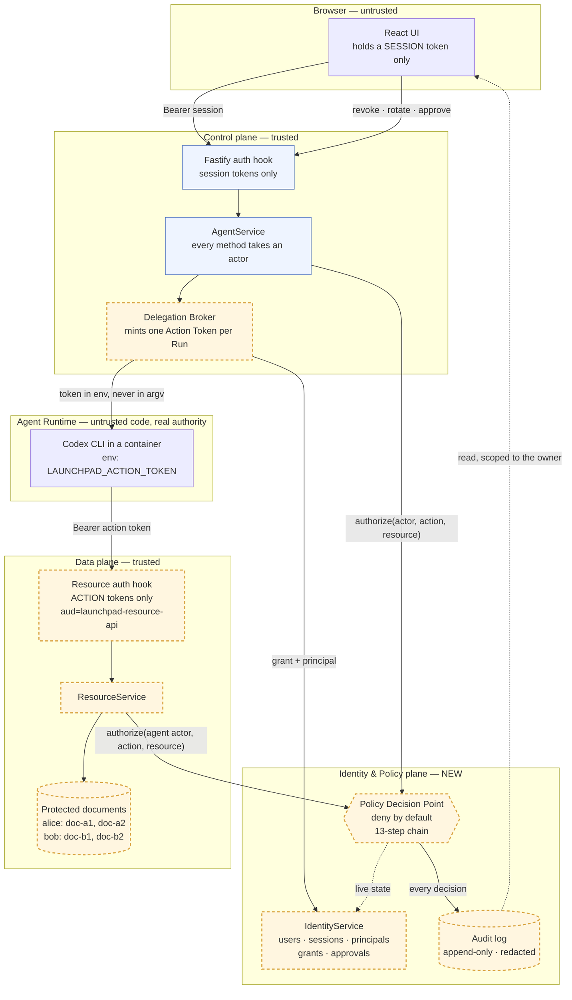
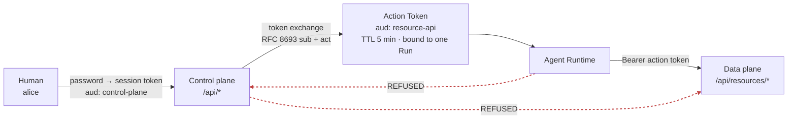
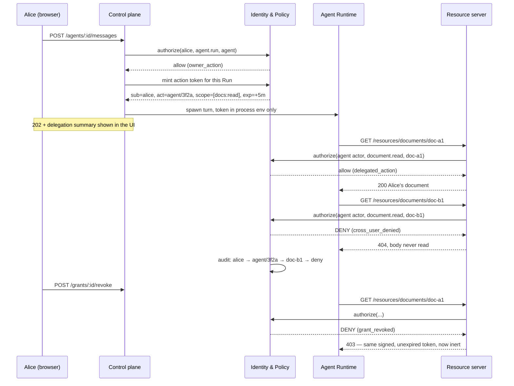

# One-page architecture: identity and authorization middleware

Everything inside the dashed boxes is new. The Starter Kit components are
unchanged except where a call now passes through the Policy Decision Point.

## The two trust boundaries that matter

Neither plane accepts the other's credential. The control plane holds
nothing it could forward downstream, so token passthrough — the confused
deputy the MCP authorization spec warns about — is not a bug we avoid, it
is a shape the system cannot express.

## The decision, end to end

